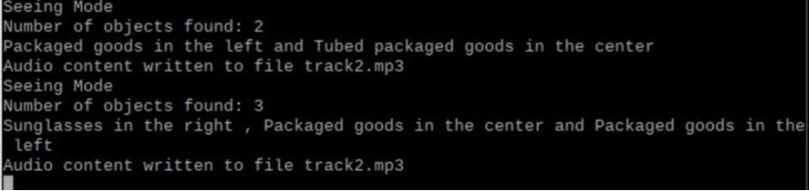
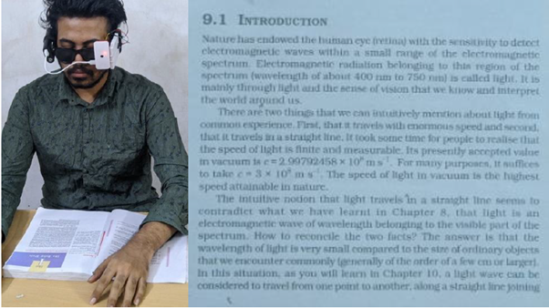
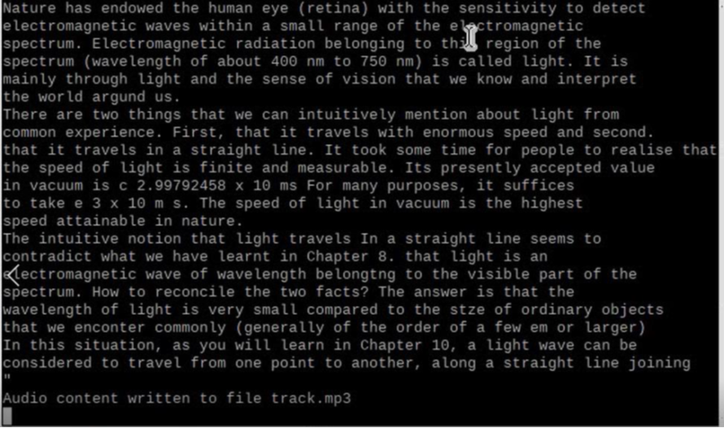
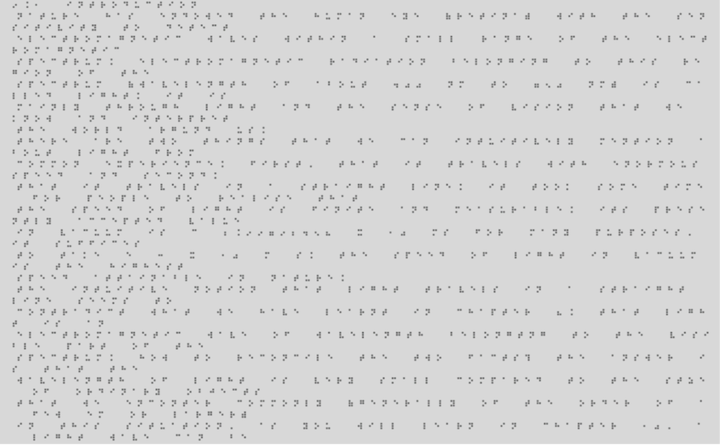
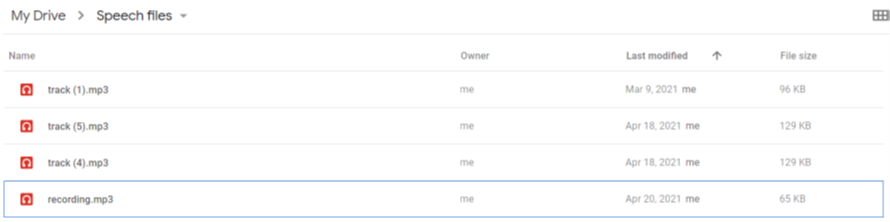
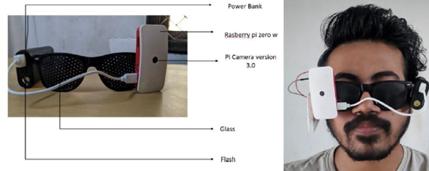

# Smart Glass with Multi-Functionalities for Assisting Visually Impaired People

An AI-powered wearable assistive system designed to help visually impaired individuals interact with their environment using **computer vision, OCR, speech processing, and braille generation**.

This project presents a **smart glass prototype** built on a Raspberry Pi platform that enables users to recognize objects, read printed text, and convert speech to braille.

## Publication

This project was developed as part of a **published research work**.

**Title:** Smart Glass with Multi-Functionalities for Assisting Visually Impaired People  

**Journal:** Journal of Physics: Conference Series  
**Conference:** ICBSII 2022  
**Publisher:** IOP Publishing  
**Year:** 2022  

Official publication link:

https://iopscience.iop.org/article/10.1088/1742-6596/2318/1/012001/pdf

A copy of the paper is also included in this repository:
paper/smart_glass_assisstive_vision_publication.pdf

## Authors

- **G. Sudharshan**
- **S. Sowdeshwar**
- **M. Jagannath**

School of Electronics Engineering  
Vellore Institute of Technology (VIT), Chennai, India

## Project Overview

Visually impaired individuals often rely on external assistance to interact with their surroundings. Many existing solutions are expensive or provide only limited functionality.

This project proposes a **low-cost smart glass system** that integrates multiple assistive capabilities into a single wearable device.

The system provides three main functionalities:

- Object recognition and spatial awareness
- Text recognition and audio reading
- Speech-to-braille generation for writing assistance

The device uses a **Raspberry Pi Zero W**, camera module, and ultrasonic sensor integrated into a wearable glasses frame.

## System Architecture

The system operates using a **three-mode architecture**:

1. Seeing Mode  
2. Reading Mode  
3. Writing Mode  

Each mode performs a different assistive function for the user.

## Hardware Components

The prototype uses the following hardware components:

- Raspberry Pi Zero W
- Raspberry Pi Camera Module (5MP)
- Ultrasonic Distance Sensor (HC-SR04)
- Bluetooth Headset
- Push Button Controls
- Portable Power Bank

These components are mounted onto a lightweight glasses frame to create a wearable assistive device.

## Software Stack

The system software was implemented using:

- Python
- Raspberry Pi OS (Raspbian)
- Google Vision API
- Google Drive API
- Optical Character Recognition (OCR)
- Text-to-Speech processing
- Braille encoding algorithms

The device captures images using the Pi camera and processes them through cloud-based computer vision services to detect objects and text.

# Features

## Seeing Mode — Object Recognition

Detects objects in the user’s surroundings and announces their spatial position.

Capabilities:

- Recognizes **550+ object classes**
- Determines spatial location (Left / Center / Right)
- Provides real-time audio feedback

Example Input:

Detection Output:

## Reading Mode — Text Recognition

Allows visually impaired users to read printed text using OCR.

Workflow:
Printed Text → OCR Detection → Audio Output → Braille Conversion

Input Example:

Detected Text:

Generated Braille File:

## Writing Mode — Speech to Braille

Converts speech input into braille text.

Workflow:
Speech Audio → Speech-to-Text → Braille Encoding → File Storage

Audio Input:

Generated Braille Output:

## Hardware Prototype

Final wearable prototype developed for the project:

The device integrates the camera, sensors, and processing unit directly into the glasses frame for portable usage.

## Future Improvements

Possible future enhancements include:

- Edge AI object detection using YOLO or MobileNet
- Offline OCR and text recognition
- Real-time obstacle detection
- Mobile app integration
- Improved braille output interfaces

